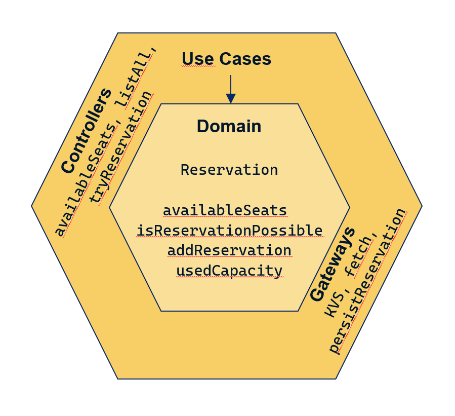
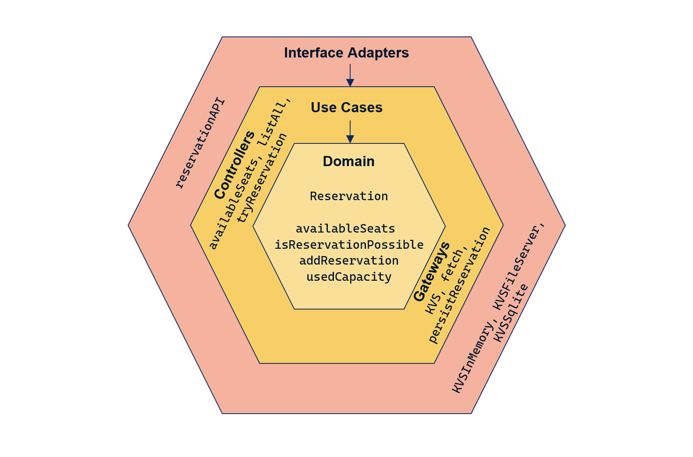
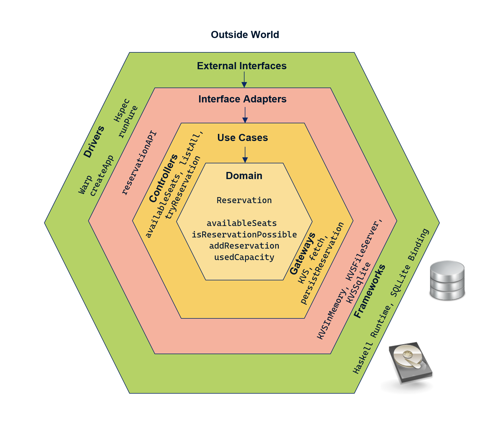

# Implementing Clean Architecture with Haskell and Polysemy


## tl;dr

This article outlines how algebraic effect systems can be useful to maintain a clear separation of concerns between 
different parts of software systems, which in turn improves the testability of those components.

I'm demonstrating this idea by using the Polysemy library to implement a REST application conforming to the 
guidelines of the Clean Architecture model.

## Motivation

While writing [Why Haskell Matters](https://github.com/thma/WhyHaskellMatters#readme) I prepared a little 
demo application that was meant to showcase a cleanly designed REST application in Haskell. 
In particular, I wanted to demonstrate how the clear separation of *pure* and *impure* code helps to
provide strict separation of concerns and state-of-the-art testability of all application layers.

**I failed!** 

I was able to write the domain logic in *pure* code consisting only of *total* functions. 
It was a great pleasure to write unit tests for them!

However, as soon as I started writing controllers that coordinate
access to the domain logic as well as to a persistence layer to retrieve and store data, I was stuck in the IO Monad.
That is, in test cases I was not able to test the controllers independently of the concrete backend.

Then I tried to apply the *final tagless* pattern for the persistence layer. This allowed abstracting out the concrete 
persistence layer and writing controller tests with a mocked persistence backend.
But when it came to testing the REST API handlers (written with Servant) I was again stuck in the IO Monad as the Handler type is defined as 
`newtype Handler a = Handler { runHandler' :: ExceptT ServerError IO a }`.
Maybe it's not a principle issue but just my brain being too small...

I was desperately looking for something that allowed me to combine different types of effects 
(like persistence, logging, configuration, http handlers, error handling, etc.) in controllers and handlers but still to be able to
write tests that allow using mocks and stubs.

As I reached a dead end, I had a look at some of the *algebraic effect systems* available in Haskell, like 
eff, extensible-effects, fused-effects, freer-simple and Polysemy. 

In algebraic effect systems, effectful programs are split into two separate parts: 
the specification of the effects to be performed, and the interpretation (or semantics) given to them.

So my idea was to provide special effect interpretations that would allow building mocked effects for my test suite.

After seeing a [presentation on maintainable software architecture with Polysemy](https://youtu.be/kIwd1D9m1gE) which answered
many of my questions I rewrote my application based on Polysemy powered algebraic effects.

I'm pretty satisfied with the result, and of course I'm eager to share my approach with you!

## The Challenge

A very small boutique restaurant (serving excellent vietnamese food) is looking for a reservation system that allows managing reservations.
The restaurant has only twenty seats, they also take only a maximum of twenty reservations per day. (So guests can stay 
the whole evening and don't have to leave after some time.)
(I adopted this scenario from a inspiring [talk by Mark Seemann](https://youtu.be/US8QG9I1XW0))

They have asked us to write the REST backend for their reservation system.

The chef insists on a scrupulously clean kitchen and is also a lover of clean code. 
He has read about clean architecture and wants his new software to be a perfect example!

So we cannot just hack away but first have to understand what is expected from us when we are to deliver a
clean architecture.

## What makes a Clean Architecture ?

I'm following the introduction to clean architecture by Robert C. Martin on his
[Clean Code blog](https://blog.cleancoder.com/uncle-bob/2012/08/13/the-clean-architecture.html). 
He states that his concept builds up on 
several earlier approaches like [hexagonal architecture](https://en.wikipedia.org/wiki/Hexagonal_architecture_(software)),
[ports and adapters](https://en.wikipedia.org/wiki/Hexagonal_architecture_(software)) or [Onion Architecture](https://jeffreypalermo.com/2008/07/the-onion-architecture-part-1/).

According to him all these approaches share a similar objective: achieve separation of concerns by dividing a software system into different layers. 
All approaches result in system designs that share a common set of features:

1. The architecture does not depend on any specific software libraries or frameworks. This allows to freely choose such tools
according to the actual needs. This avoids "vendor lock in".

2. High testability. The business logic can be tested without any external element like UI, DB, Web Server, etc.

3. The UI is loosely coupled to the core system. So it can be easily changed or replaced without affecting the rest of the system.

4. The Database is also "external" to the core system. It can be easily changed (even from an RDBMS to NonSQL DB) without affecting the business logic.

5. The Business logic is agnostic of the outside world. It has no dependencies to any external systems like DB, ESB, etc.
 
<!-- 
He tries to condense the essence of the different approaches into a single big picture:

 
 -->
### Layers with clearly separated responsibilities
 
The architecture consists of four layers, each of which contains components with a specific scope and a limited set of responsibilities.

1. At the centre sits the **Domain** layer consisting of entities and core business logic.
2. Next comes the **Use Cases** layer where all resources are coordinated that are required to fulfill a given use case.
   In particular, it uses entities and logic from the domain layer to implement use cases.
3. The **Interface Adapters** layer holds code for UI controllers and presenters as well as adapters to external 
   resources like databases, message queues, configuration, Logging, etc.
4. The **External Interfaces** layer contains the technical implementation of external interfaces. For example,
   a concrete REST service assembly, Web and UI infrastructure, databases, etc. 
 
 ### The Dependency Rule
  
> The overriding rule that makes this architecture work is The Dependency Rule. This rule says that source code 
> dependencies can only point inwards. Nothing in an inner circle can know anything at all about something in an outer 
> circle. In particular, the name of something declared in an outer circle must not be mentioned by the code in the an 
> inner circle. That includes, functions, classes. variables, or any other named software entity.
>
> Quoted from [Clean Architecture blog post](https://blog.cleancoder.com/uncle-bob/2012/08/13/the-clean-architecture.html)

This dependency rule leads to a very interesting consequence: If a use case interactor needs to 
access a component from an outer circle, e.g. retrieve data from a database, this must be done
in a specific way in order to avoid breaking the dependency rule:
In the use case layer we don't have any knowledge about the components of the outer circles.
**If we require access to a database (or any other external resources), the call interface, 
as well as the data transfer protocol must be specified in the use case layer.**

The components in the outer circles will then implement this interface. Using this kind of interfaces, 
it is possible to communicate accross the layer boundaries, but still maintain a strict separation of
concerns. 

If you want to dive deeper into clean architecture I recommend the
[Clean Architecture blog post](https://blog.cleancoder.com/uncle-bob/2012/08/13/the-clean-architecture.html)
as an entry point. Robert C. Martin later also published a whole book 
[Clean Architecture: A Craftsman's Guide to Software Structure and Design](https://www.amazon.com/Clean-Architecture-Craftsmans-Software-Structure/dp/0134494164) 
on this concept.

In the following sections I'll explain how the clean architecture guidelines can be implemented in a 
Haskell REST API application by making use of the algebraic effect library 
[Polysemy](https://github.com/polysemy-research/polysemy#readme).

## The Domain layer

The [ReservationDomain](src/Domain/ReservationDomain.hs) module implements the business logic for 
seat reservations in a very small boutique restaurant. The restaurant has only one big table with 20 seats.
Each day the restaurants accepts only 20 reservations. (There is no limited time-slot for each guest.)

Please note: 
- all functions in this module are **pure** (they don't do any IO) and **total** (they produce defined 
results for all possible input values).

- The definitions in this module do not have dependencies to anything from the outer circles.

This makes it easy to test them in isolation. 

At the core of our Domain lies the `Reservation` data type:

```haskell
-- | a data type representing a reservation
data Reservation = Reservation
    { date     :: Day    -- ^ the date of the reservation
    , name     :: String -- ^ the name of the guest placing the reservation
    , email    :: String -- ^ the email address of the guest
    , quantity :: Natural    -- ^ how many seats are requested
    }
    deriving (Eq, Generic, Read, Show)
```

This type can be used to express facts like *Mr. Miller reserved two seats on 2020-06-01, 
he can be reached via his email address: manfred@miller.com*:

```haskell
reservation = Reservation {name = "Mr. Miller", quantity = 2, date = read "2020-06-01", email = "manfred@miller.com"}
```

All reservations of a specific day are represented as a list of reservations: `[Reservation]`.

A `ReservationMap` is a map from `Day` to `[Reservation]`:

```haskell
-- | a key value map holding a list of reservations for any given day
type ReservationMap = Map Day [Reservation]
```

That is, we can keep track of all reservations by maintaining them in such a map:

```haskell
fromList 
  [
    (
      2020-06-01,
        [
          Reservation {date = 2020-06-01, name = "Mr. Miller", email = "manfred@miller.com", quantity = 2}, 
          Reservation {date = 2020-06-01, name = "Andrew M. Jones", email = "amjones@example.com", quantity = 4}
        ]
    )
  ]
```

Based on these data types we can define domain logic like computing the used capacity of a list of reservations:

```haskell
-- | computes the number of reserved seats for a list of reservations
usedCapacity :: [Reservation] -> Natural
usedCapacity [] = 0
usedCapacity (Reservation _ _ _ quantity : rest) = quantity + usedCapacity rest
```

Based on this we can compute the number of available seats (given a maximum capacity and a list of reservations):

```haskell
-- | computes the number of available seats from a maximum capacity and a list of reservations.
availableSeats :: Natural-> [Reservation] -> Natural
availableSeats maxCapacity reservations = maxCapacity - usedCapacity reservations
```

The `Reservation` data type and some of the domain logic functions are depicted in the in the following
diagram:


### Testing

As already mentioned: this layer has no knowledge of the world, it's all pure code.
Testing therefore is straight forward, as you can see from the [DomainSpec](test/DomainSpec.hs) code.

The data types and functions of the domain layer can be used without any mocking of components:

```haskell
day = fromGregorian 2020 1 29
res1 = Reservation day "Andrew M. Jones" "amjones@example.com" 4
res2 = Reservation day "Thomas Miller" "tm@example.com" 3
reservations = [res1, res2]
totalCapacity = 20

spec :: Spec
spec =
  describe "Domain Logic" $ do
    it "computes the used capacity for an empty list of reservations" $
      usedCapacity [] `shouldBe` 0

    it "computes the used capacity for a list of reservations" $
      usedCapacity [res1, res2] `shouldBe` 7
      
    it "computes the available seats for a list of reservations" $
      availableSeats totalCapacity [res1, res2] `shouldBe` 13
```

## The Use Case layer

> The software in this layer contains application specific business rules. It encapsulates and implements all of the 
> use cases of the system. These use cases orchestrate the flow of data to and from the entities, and direct those 
> entities to use their enterprise wide business rules to achieve the goals of the use case.
>
> Quoted from the [Clean Architecture blog post](https://blog.cleancoder.com/uncle-bob/2012/08/13/the-clean-architecture.html)

The module [ReservationUseCase](src/UseCases/ReservationUseCase.hs) specifies the available use cases for the reservation system.
It coordinates access to Effects and the actual domain logic.
The module exposes service functions that will be used by the REST API in the ExternalInterfaces layer.

Implemented Use Cases:

1. Display the number of available seats for a given day

2. Enter a reservation for a given day and keep it persistent.
   If the reservation can not be served as all seats are occupies prode a functional error message stating
   the issue.

3. Display the list of reservations for a given day.

4. Delete a given reservation from the system in case of a cancellation.
   NO functional error is required if the reservation is not present in the system.

5. Display a List of all reservation in the system.

In the Use Case layer we have left the garden Eden of *world agnostic* code:

In order to compute the number of available seats for a given day, we will have to
first look up the actual reservations for that day from a persistent storage, 
and only then can we call the domain function `availableSeats`.
In addition we also will have to write a Log message when calling the functions
to provide an audit trail.

The dependency rule of clean architecture bans all direct access to a database or a 
logging-infrastructure from the use case layer.

### How can we define such a use case without violating the dependency rule?

Algebraic Effect systems offer a consistent answer: 
1. We **declare effects** in the use case layer by defining them as an abstract interface.
2. We also specify the actual **usage of effects** in the use case layer by having calls against the abstract interface.
3. We provide an **interpretation** of these effects only in the outer layers.
   This also allows us to provide different implementations. 
   So we can easily swap backends, e.g. migrating from MySQL to PostgreSQL, 
   and it can be used to provide mock implementations for testing purposes.

Let's see how this looks like when using Polysemy to specify effects.

### Usage of effects

```haskell
-- | compute the number of available seats for a given day.
availableSeats :: (Member Persistence r, Member Trace r) => Day -> Sem r Natural
availableSeats day = do
  trace $ "compute available seats for " ++ show day
  todaysReservations <- fetch day
  return $ Dom.availableSeats maxCapacity todaysReservations

-- | fetch the list of reservations for a given day from the key value store.
--   If no match is found, an empty list is returned.
fetch :: (Member Persistence r, Member Trace r) => Day -> Sem r [Dom.Reservation]
fetch day = do
  trace $ "fetch reservations for " ++ show day
  maybeList <- getKvs day
  return $ fromMaybe [] maybeList

-- | the maximum capacity of the restaurant.
maxCapacity :: Natural
maxCapacity = 20
```

The type signature of `availableSeats` contains two constraints on the *effect stack* type `r`: `(Member ReservationTable r, Member Trace r)`
This means that the function may perform two different effects: persistence via the `Persistence` effect and 
Logging via the `Trace` effect.

The type signature also specifies that we need an input of type `Day` and will return the `Natural` result
wrapped in the `Sem r` monad.

The `Sem` monad handles computations of arbitrary extensible effects.
A value of type `Sem r` describes a program with the capabilities of the effect stack `r`.

The first step of the function body of `availableSeats` specifies a Log action based on the (Polysemy built-in) 
`Trace` effect:

```haskell
  trace $ "compute available seats for " ++ show day
```

I repeat: `trace ` does not directly do any logging. The actual logging action is defined in the application 
assembly or in a test setup.

The next line specify a lookup of the reservation list for `day` from the persistence layer:

```haskell
  todaysReservations <- fetch day
```

where fetch is defined as:

```haskell
fetch :: (Member Persistence r, Member Trace r) => Day -> Sem r [Dom.Reservation]
fetch day = do
  trace $ "fetch reservations for " ++ show day
  maybeList <- getKvs day
  return $ fromMaybe [] maybeList
```

### Declaration of effects

To understand the `fetch` function, in particular the expression `maybeList <- getKvs day` we first have to know the 
definition of the `Persistence` effect:

```haskell
type Persistence = KVS Day [Dom.Reservation]
```
Where KVS (standing for Key/Value Store) is a type that is 
[also defined in the use case layer](src/UseCases/KVS.hs):

```haskell
-- | a key value store specified as a GADT
data KVS k v m a where
  ListAllKvs :: KVS k v m [(k, v)]
  GetKvs     :: k -> KVS k v m (Maybe v)
  InsertKvs  :: k -> v -> KVS k v m ()
  DeleteKvs  :: k -> KVS k v m ()

makeSem ''KVS
```

The four operations of the key value store are defined in the GADT as type constructors.
`makeSem ''KVS` then uses TemplateHaskell to generate effect functions (or smart Constructors) from the GADT definition.
This call results in the definition of the following four functions that represent the specific operations of the key value store:

```haskell
listAllKvs :: Member (KVS k v) r => Sem r [(k, v)]
getKvs     :: Member (KVS k v) r => k -> Sem r (Maybe v)
insertKvs  :: Member (KVS k v) r => k -> v -> Sem r ()
deleteKvs  :: Member (KVS k v) r => k -> Sem r ()
```

These functions can be used in the `Sem` Monad. So now we understand much better what happens in `fetch`:

```haskell
fetch :: (Member Persistence r, Member Trace r) => Day -> Sem r [Dom.Reservation]
fetch day = do
  trace $ "fetch reservations for " ++ show day
  maybeList <- getKvs day
  return $ fromMaybe [] maybeList
```

As `fetch` operates in the `Sem` monad, `maybeList` is bound to a `Maybe [Dom.Reservation]` value, 
which results from the `getKVs day` action.
The function finally uses `fromMaybe` to return a list of reservations that were retrieved (or `[]` in case `Nothing`
was found for `day`).

Then, back in `availableSeats` we call the domain logic function `Dom.availableSeats` to compute the number of available seats.
The resulting `Natural` value is lifted into the `Sem r` monad, thus matching the signature of the return type `Sem r Natural`.

In the next diagram I'm depicting the layers Use Cases and Domain. The arrow from Use Cases to Domain represents the dependency
rule: use case code may only reference domain logic but nothing from outer layers.
  
On the left side of the diagram we see the use case controllers (aka *use case interactors*) like `availableSeats` that 
coordinate all activities and resources to fulfill a specific use case.

On the right we see the gateway (or interface) code like the `KVS` abstraction of a key-value store or the `fetch` 
operation that wraps the access to the key-value store.



### Interpretation of effects / Testing

The key value store functions like `getKvs` don't perform any concrete operation. They just `declare` access to
an abstract key-value store interface.

The concrete interpretation of these calls will be specified in the application assembly (typically in `Main.hs`) or
in the setup code of test cases.
If we provide a *pure* interpretation then the resulting code will also be pure. 
This allows writing tests in the same pure way as for the domain logic.

As an example, in [UseCasePureSpec](test/UseCasePureSpec.hs) I'm providing pure interpretations 
for all effects. 

The `runPure` function takes a program with effects and handles each effect till it gets reduced 
to `[Either ReservationError (ReservationMap‚ a)]`:

```haskell
runPure :: ReservationMap
        -> (forall r. Members [UC.Persistence, Error UC.ReservationError, Trace] r => Sem r a)
        -> [Either UC.ReservationError (ReservationMap, a)]
runPure kvsMap program =
  program
     & runKvsPure kvsMap              -- run the key-value store on a simple ReservationMap
     & runError @UC.ReservationError  -- run error handling to produce an Either UC.ReservationError (ReservationMap, a)
     & ignoreTrace                    -- run Trace by simply ignoring all messages 
     & runM                           -- wrap everything in a monadic type, [] in this case
```

In addition to that I'm providing wrapping functions like `runAvailableSeats` that use `runPure` to interprete the effects of
the actual use case functions (eg. `UC.availableSeats`) and extract the actual result from the 
`[Either UC.ReservationError (ReservationMap, a)]` return value:

```haskell
runAvailableSeats :: ReservationMap -> Day -> Natural
runAvailableSeats kvsMap day = do
  case runPure kvsMap (UC.availableSeats day) of
    [Right (_, numSeats)] -> numSeats
    [Left err]            -> error "availableSeats failed"
```

This is all that it takes to abstract away a persistence layer, a logging facility and exception handling. 
We can now write tests in pure code:

```haskell
-- setting up test fixtures
initReservations :: ReservationMap
initReservations = M.singleton day res

day = read "2020-05-02"
res = [Reservation day "Andrew M. Jones" "amjones@example.com" 4]

spec :: Spec
spec =
  describe "Reservation Use Case (only pure code)" $ do
  
    it "computes the number of available seats for a given day" $ do
      (runAvailableSeats initReservations day) `shouldBe` 16
```

## The Interface Adapters layer

This layer holds code for adapters to external resources like databases, message queues, 
configuration, Logging, etc.

The Logging effect `Trace` ships with Polysemy, so we don't have to implement anything here.
(Of course we could overzealously implement our own Graylog adapter here, 
but I leave this as an exercise for the reader... )

But as the `KVS` type is our own invention we have to provide our own implementations.
(Of course, we could have used the `KVStore` type from [polysemy-zoo](https://hackage.haskell.org/package/polysemy-zoo-0.7.0.0/docs/Polysemy-KVStore.html),
but for didactic purposes we will roll our own.)

The following code is the in-memory 
implementation from the [KVSInMemory](src/InterfaceAdapters/KVSInMemory.hs) module.
It defines a key-value store in term of `State (Map k v)` that is a `Map k v` in a `State` effect context:

```haskell
runKvsOnMapState :: ( Member (State (M.Map k v)) r, Ord k) 
                 => Sem (KVS k v : r) a 
                 -> Sem r a
runKvsOnMapState = interpret $ \case
  ListAllKvs    -> fmap M.toList get
  GetKvs k      -> fmap (M.lookup k) get
  InsertKvs k v -> modify $ M.insert k v
  DeleteKvs k   -> modify $ M.delete k
```

So whenever the `interpret` functions detects a `GetKvs k` value, that was constructed by a call to `getKvs k` in the use case layer,
it pattern matches it to a Map lookup of `k` that is executed against state retrieved by `get`.
 
Interestingly `get` is a smart constructor of the `State` effect. This means that by interpreting the `KVS` we have
created new effects that in turn have to be interpreted. 

The `runKvsPure` functions (which we already have seen in the use case testing) 
chains interpretation of the effects `KVS` and `State` and thus allows us to work with pure Maps as
mocks for a key-value store:

```haskell
runKvsPure :: Ord k 
           => M.Map k v
           -> Sem (KVS k v : State (M.Map k v) : r) a 
           -> Sem r (M.Map k v, a)
runKvsPure map = runState map . runKvsOnMapState
```

### A key-value store with a SQLite backend.

As we are in the interface adapters layer, we are allowed to get our hands dirty with
*real world code*, like database access. As an example I have provided a SQLite based interpretaion of the `KVS` effect
in [KVSSqllite.hs](src/InterfaceAdapters/KVSSqlite.hs).

The effect interpreting function is `runKvsAsSQLite`:

```haskell
-- | Run a KVStore effect against a SQLite backend. Requires a Config object as input.
runKvsAsSQLite :: (Member (Embed IO) r, Member (Input Config) r, Member Trace r, Show k, Read k, ToJSON v, FromJSON v)
                   => Sem (KVS k v : r) a
                   -> Sem r a
runKvsAsSQLite = interpret $ \case
  GetKvs k      -> getAction k
  ListAllKvs    -> listAction
  InsertKvs k v -> insertAction k v
  DeleteKvs k   -> deleteAction k
```

The function's type signature introduces a two more constraints on the effect stack type `r`: 
`Member (Embed IO) r` and `Member (Input Config) r`. 
`(Embed IO)` is needed as accessing SQLite will require IO, which can be lifted into the `Sem r` monad with `Embed IO`.

SQLite always needs a file name to create a database connection. As we want to be able to keep this name configurable, we
use the `(Input Config)` effect. `
Config` is a data type that I created to represent global application configuration,
including the database file name.
`Input` is a Polysemy built-in effect which can provide input to an application, quite similar to a `Reader` monad.

These effects are introduced by the actual implementations of the `KVS` constructors, like `getAction k`, which retrieves
a value from the database by looking up the key `k`:

```haskell
getAction :: (Member (Input Config) r, Member (Embed IO) r, Member Trace r, Show k, Read k, ToJSON v, FromJSON v) => k -> Sem r (Maybe v)
getAction key = do
  conn <- connectionFrom input
  rows <- embed (SQL.queryNamed conn
                      "SELECT key, value FROM store WHERE key = :key"
                      [":key" := show key] :: IO [KeyValueRow])
  trace $ "get: " ++ show rows
  case rows of
    []                          -> return Nothing
    (KeyValueRow _key value):xs -> return $ (decode . encodeUtf8) value

-- | create a connection based on configuration data, make sure table "store" exists.
connectionFrom :: (Member (Embed IO) r) => Sem r Config -> Sem r SQL.Connection
connectionFrom c = do
  config <- c
  embed (getConnection (dbPath config))
    where
      getConnection :: FilePath -> IO SQL.Connection
      getConnection dbFile = do
        conn <- SQL.open dbFile
        SQL.execute_ conn "CREATE TABLE IF NOT EXISTS store (key TEXT PRIMARY KEY, value TEXT)"
        return conn
```

Let's have a closer look at what is going on in `getAction`:

First `connectionFrom input` is used to create a database connection based on the `Config` object obtained by `input` 
(the smart Constructor of the `Input` effect).
The `Config` type contains a field `dbPath` which is read and used to create the connection with `getConnection`.
As this is an IO operation we have to use `embed` to lift it into the `Sem r` monad.

In the second step `SQL.queryNamed` is used to perform the actual select statement against the db connection.
Again `embed` must be used to lift this IO operation.

Finally the resulting `[KeyValueRow]` list is pattern matched: if the list is empty `Nothing` is returned.
Otherwise `Aeson.decode` is called to unmarshal a result value from the JSON data retrieved from the database.

The JSON encoding and decoding to and from the DB is the reason for the `ToJSON v, FromJSON v` constraints on the value type `v`.

This implementation is inpired by key-value store of
[a password manager in Polysemy](https://haskell-explained.gitlab.io/blog/posts/2019/07/31/polysemy-is-cool-part-2/index.html).

### Declaring the REST API

Our task was to build the backend for the reservation system. We will have to implement a REST API to allow access to the
business logic that we defined in the use case layer.

The overall idea is to provide a REST route for all of the exposed functions of the `ReservationUseCase`.
The following tyble shows the mapping of those functions to the REST routes that we want to map them to:

```
listAll        GET    /reservations
fetch          GET    /reservations/YYYY-MM-DD
tryReservation POST   /reservations
cancel         DELETE /reservations
availableSeats GET    /seats/YYYY-MM-DD
```
I'm using [Servant](http://www.servant.dev/) to define our REST API.
The great thing about Servant is that it allows us to define REST APIs in a typesafe manner by using a
type level DSL.

Here comes the declaration of our API (please note that we declare our routes to accept and emit data in JSON format):

```haskell
-- | in order to allow JSON serialization for the Dom.Reservation type, it must instantiate FromJSON and ToJSON.
instance ToJSON Dom.Reservation
instance FromJSON Dom.Reservation

-- | Declaring the routes of the REST API for Restaurant Reservations
type ReservationAPI =
       "reservations" :> Summary "retrieve a map of all reservations (Day -> [Reservation])"
                      :> Get     '[ JSON] Dom.ReservationMap -- GET    /reservations

  :<|> "reservations" :> Summary "retrieve list of reservations for a given day"
                      :> Capture "day" Day
                      :> Get     '[ JSON] [Dom.Reservation]  -- GET    /reservations/YYYY-MM-DD

  :<|> "reservations" :> Summary "place a new reservation"
                      :> ReqBody '[ JSON] Dom.Reservation
                      :> Post    '[ JSON] ()                 -- POST   /reservations

  :<|> "reservations" :> Summary "cancel a reservation"
                      :> ReqBody '[ JSON] Dom.Reservation
                      :> Delete  '[ JSON] ()                 -- DELETE /reservations
                      
  :<|> "seats"        :> Summary "retrieve number of free seats for a given day"
                      :> Capture "day" Day
                      :> Get     '[ JSON] Natural                -- GET    /seats/YYYY-MM-DD
```

Next we have to create the connection between the declared routes and the actual business logic. This will be our
REST service implementation. In our case we simply delegate to the use case controller functions.
Off course, we might also implement additional functionality here like validation:

```haskell
import qualified UseCases.ReservationUseCase as UC 

-- | implements the ReservationAPI
reservationServer :: (Member UC.Persistence r, Member (Error UC.ReservationError) r, 
                      Member Trace r, Member (Input Config) r) => ServerT ReservationAPI (Sem r)
reservationServer =
        UC.listAll        -- GET    /reservations
  :<|>  UC.fetch          -- GET    /reservations/YYYY-MM-DD
  :<|>  UC.tryReservation -- POST   /reservations
  :<|>  UC.cancel         -- DELETE /reservations
  :<|>  UC.availableSeats -- GET    /seats/YYYY-MM-DD
```

I really love how **declarative** this code is. **We don't have to tell how** to exchange data between the REST server and
the use case controllers.

We **just tell what we want**: a mapping from the routes to the controller functions.
That's all!

In the following diagram, we now see the third layer. Again, the Interface Adapters layer may only reference code from the
inner layers.
To the right we see the `ReservationAPI` and its `reservationServer` implementation, which we just explored. They interface with
the use case controller functions like `availableSeats`, `listAll`, etc.

To the left we see the interpretations of the `KVS` effect (which was defined in the use case layer): `KVSInMemory`, 
`KVSSqlite` (and a third one `KVSFileServer`, a file based implementation which you might explore on your own).



### Testing the KVS implementations

We'll have a closer look at the [test of the SQLite implementation](test/InterfaceAdaptersKVSSQLiteSpec.hs)
of the `KVS` effect.

As Polysemy effects are involded we will need to provide an interpretation to actually perform the SQLLite operation.

The test setup looks quite similar to the tests in the use case layer.

We want our test to evaluate the KVS implementation independently of the domain logic and the use case layer.
Therefore, we first define an example use case, featuring a data type `Memo` and a set of typical CRUD operations. The CRUD 
operations are using the `KVS` smart constructors and thus exhibit the typical Polysemy effect signatures:

```haskell
-- | a key value table mapping Natural to a list of Strings
type KeyValueTable = KVS Int [String]

data Memo = Memo Int [String]
    deriving (Show)

persistMemo :: (Member KeyValueTable r)  => Memo -> Sem r ()
persistMemo (Memo id lines ) = insertKvs id lines

fetchMemo :: (Member KeyValueTable r) => Int -> Sem r (Maybe [String])
fetchMemo = getKvs

fetchAll :: (Member KeyValueTable r) => Sem r (M.Map Int [String])
fetchAll = fmap M.fromList listAllKvs

deleteMemo :: (Member KeyValueTable r)  => Int -> Sem r ()
deleteMemo = deleteKvs
```

Next we define a set of helper functions that allow us to execute the CRUD operations as ordinary `IO ()` actions,
which we can use in our test code:

```haskell
-- Helper functions for interpreting all effects in IO
runPersist :: Memo -> IO ()
runPersist memo = runAllEffects (persistMemo memo)

runFetch :: Int -> IO (Maybe [String])
runFetch k = runAllEffects (fetchMemo k)

runFetchAll :: IO (M.Map Int [String])
runFetchAll = runAllEffects fetchAll

runDelete :: Int -> IO ()
runDelete k = runAllEffects (deleteMemo k)
```

These wrapper function make use of the `runAllEffects` function that takes a program with effects 
and handles each effect till it gets reduced to `IO a`:

```haskell
runAllEffects :: (forall r. Members [KeyValueTable, Input Config] r => Sem r a) -> IO a
runAllEffects program =
  program
    & runKvsAsSQLite       -- use SQLite based interpretation of the (KVS Int [String]) effect
    & runInputConst config -- use the variable config as source for (Input Config) effect
    & ignoreTrace          -- ignore all traces
    & runM                 -- reduce Sem r (Embed IO a) to IO a
  where config = Config {port = 8080, dbPath = "kvs-test.db", backend = SQLite, verbose = False}

-- errors are rethrown as Runtime errors, which can be verified by HSpec.
handleErrors :: IO (Either err a) -> IO a
handleErrors e = do
  either <- e
  case either of
    Right v -> return v
    Left _  -> error "something bad happend"
```

With these preliminaries at hand we can now write our test cases:

```haskell
key = 4711
text = ["In the morning", "I don't drink coffee", "But lots of curcuma chai."]
memo = Memo key text

spec :: Spec
spec =
  describe "The KV Store SQLite Implementation" $ do
    it "returns Nothing if nothing can be found for a given id" $ do
      maybeMatch <- runFetch key
      maybeMatch `shouldBe` Nothing

    it "persists a key-value pair to the SQLite database" $ do
      runPersist memo
      maybeMatch <- runFetch key
      maybeMatch `shouldBe` Just text

    it "fetches a Map of all key-value entries from the KV store" $ do
      map <- runFetchAll
      M.size map `shouldBe` 1

    it "deletes an entry from the key value store" $ do
      runDelete key
      maybeMatch <- runFetch key
      maybeMatch `shouldBe` Nothing
```

### Testing the REST API

The actual code for testing the REST API looks pretty straightforward. We create a [WAI](https://hackage.haskell.org/package/wai) 
`Application` instance with `createApp` and execute REST operations like `get` and `postJSON` against it:

```haskell
reservationData :: LB.ByteString
reservationData = "{\"email\":\"amjones@example.com\",\"quantity\":10,\"date\":\"2020-05-02\",\"name\":\"Amelia Jones\"}"

postJSON   path = request methodPost   path [(hContentType, "application/json")]
deleteJSON path = request methodDelete path [(hContentType, "application/json")]

spec :: Spec
spec =
  with (createApp) $
    describe "Rest Service" $ do
      it "responds with 200 for a call GET /reservations " $
        get "/reservations" `shouldRespondWith` "{\"2020-05-02\":[{\"email\":\"amjones@example.com\",\"quantity\":4,\"date\":\"2020-05-02\",\"name\":\"Andrew M. Jones\"}]}"
      it "responds with 200 for a valid POST /reservations" $
        postJSON "/reservations" reservationData `shouldRespondWith` 200
      it "responds with 412 if a reservation can not be done on a given day" $
        (postJSON "/reservations" reservationData >> postJSON "/reservations" reservationData) `shouldRespondWith` 412
      it "responds with 200 for a valid DELETE /reservations" $
        deleteJSON "/reservations" reservationData `shouldRespondWith` 200
```

Please note that these tests don't need a deployment of the WAI application to a web server. ALl testing can be done
within  a single process. We stick to the depency rule not to use anything from a more outward layer.

The interesting part is the creation of the `Application` instance.

If we had a simple implementation `myServer` of a REST API `myApi`, which does not use any Polysemy effetcs, then we
could create an `Application` instance like so:

```haskell
createSimpleApp :: Application
createSimpleApp ::= serve myApi myServer
```

Our `reservationServer` has a type signature that constains Polysemy effects:

````haskell
reservationServer :: (Member UC.Persistence r, Member (Error UC.ReservationError) r, 
                      Member Trace r, Member (Input Config) r) => ServerT ReservationAPI (Sem r)
````

Instead of building the `Application` instance directly, as in the simple example, 
we use `liftServer` to lift `reservationServer` into the required `ServerT ReservationAPI Handler` 
type by running all effects and by lifting the business logic exception `ReservationNotPossible` 
into a Servant `ServerError`.
This time we also use the SQLite based interpretation of the `KVS` effect:

```haskell
createApp :: Config -> IO Application
createApp config = return $ serve reservationAPI (liftServer config)

liftServer :: Config -> ServerT ReservationAPI Handler
liftServer config = hoistServer reservationAPI (interpretServer config) reservationServer
  where
    interpretServer config sem =
      sem
        & runKvsAsSQLite
        & runInputConst config
        & runError @ReservationError
        & ignoreTrace
        & runM
        & liftToHandler
    liftToHandler = Handler . ExceptT . (fmap handleErrors)
    handleErrors (Left (ReservationNotPossible msg)) = Left err412 {errBody = pack msg}
    handleErrors (Right value) = Right value
```

## The External Interfaces layer  

> The outermost layer is generally composed of frameworks and tools such as the Database, the Web Framework, etc. 
> Generally you don’t write much code in this layer other than glue code that communicates to the next circle inwards.
>  
> This layer is where all the details go. The Web is a detail. The database is a detail. 
> We keep these things on the outside where they can do little harm.
> 
> Quoted from [Clean Architecture blog post](https://blog.cleancoder.com/uncle-bob/2012/08/13/the-clean-architecture.html)

For the database we are already finished as the [SQlite-Simple](https://hackage.haskell.org/package/sqlite-simple) library
includes the SQLLite C implementation and is thus self-contained.

We will use [WARP](http://www.aosabook.org/en/posa/warp.html)  as our Web Server, which can be used as a library within
our `Main` program. 
What we still have to do though, is to assemble a Servant web `Application` so that it can be executed on the warp server.

We have done this step already for the testing of the REST service. The `createApp` function that we define in the 
[ApplicationAssembly module](src/ExternalInterfaces/ApplicationAssembly.hs) will look quite familiar, 
it just provides some more bells and whistles to integrate all the features that we have developed so far.

- `createApp` accepts a `Config` parameter which is used to configure application settings.
- `selectKvsBackend` selects the concrete `KVS` interpretation.
- `selectTraceVerbosity` selects the `Trace` interpretation:
  
```haskell
-- | creates the WAI Application that can be executed by Warp.run.
-- All Polysemy interpretations must be executed here.
createApp :: Config -> IO Application
createApp config = do
  return (serve reservationAPI $ hoistServer reservationAPI (interpretServer config) reservationServer)
  where
    interpretServer config sem  =  sem
      & selectKvsBackend config
      & runInputConst config
      & runError @ReservationError
      & selectTraceVerbosity config
      & runM
      & liftToHandler
    liftToHandler = Handler . ExceptT . (fmap handleErrors)
    handleErrors (Left (ReservationNotPossible msg)) = Left err412 { errBody = pack msg}
    handleErrors (Right value) = Right value

-- | can select between SQLite or FileServer persistence backends.
selectKvsBackend :: (Member (Input Config) r, Member (Embed IO) r, Member Trace r, Show k, Read k, ToJSON v, FromJSON v)
                 => Config -> Sem (KVS k v : r) a -> Sem r a
selectKvsBackend config = case backend config of
  SQLite     -> runKvsAsSQLite
  FileServer -> runKvsAsFileServer
  InMemory   -> error "not supported"

-- | if the config flag verbose is set to True, trace to Console, else ignore all trace messages
selectTraceVerbosity :: (Member (Embed IO) r) => Config -> (Sem (Trace : r) a -> Sem r a)
selectTraceVerbosity config =
  if verbose config
    then traceToIO
    else ignoreTrace
```  

The application assembly also features a function to load a `Config` instance. Typically, this would involve loading
a YAML file or reading command line arguments. We take a short cut here and just provide a static instance:

```haskell
-- | load application config. In real life, this would load a config file or read commandline args.
loadConfig :: IO Config
loadConfig = return Config {port = 8080, backend = SQLite, dbPath = "kvs.db", verbose = True}
```

With the whole application assembly written as library code, there is not much left to do in the `Main` module:

```haskell
import           ExternalInterfaces.ApplicationAssembly (createApp, loadConfig)
import           InterfaceAdapters.Config
import           Network.Wai.Handler.Warp               (run)

main :: IO ()
main = do
  config <- loadConfig
  app    <- createApp config
  putStrLn $ "Starting server on port " ++ show (port config)
  run (port config) app
```
  
The following diagram shows the elements added by the External Interface layer:
- On the left we have application assembly code like `createApp` used by the `Warp` server or some of the different
  `runPure` functions that we used in HSpec tests.
- On the right we have the SQLite runtime library that provides access to the SQLite database
  and the Haskell runtime in general, that provides access to the OS in general.



### Testing

Testing the application assembly is quite straightforward and resembles the testing of the REST service:


```haskell
loadConfig :: IO Config
loadConfig = return Config {port = 8080, backend = SQLite, dbPath = "kvs-assembly.db", verbose = False}

spec :: Spec
spec =
  with (loadConfig >>= createApp) $
    describe "Rest Service" $ do

      it "responds with 20 for a first call to GET /seats/YYYY-MM-DD" $
        get "/seats/2020-05-02" `shouldRespondWith` "20"

      it "responds with 200 for a valid POST /reservations" $
        postJSON "/reservations" reservationData `shouldRespondWith` 200

      it "responds with 200 for a call GET /reservations " $
        get "/reservations" `shouldRespondWith` "{\"2020-05-02\":[{\"email\":\"amjones@example.com\",\"quantity\":12,\"date\":\"2020-05-02\",\"name\":\"Amelia Jones\"}]}"

      it "responds with 412 if a reservation can not be done on a given day" $
        (postJSON "/reservations" reservationData >> postJSON "/reservations" reservationData) `shouldRespondWith` 412

      it "responds with 20 for a first call to GET /seats/YYYY-MM-DD" $
        get "/seats/2020-05-02" `shouldRespondWith` "8"

      it "responds with 200 for a valid DELETE /reservations" $
        deleteJSON "/reservations" reservationData `shouldRespondWith` 200
```

## Swagger Documentation

For all those who have been patient enough to stay with me until here, I now have a little bonus.

There is an addon available for Servant which allows to serve a [SwaggerDoc UI](https://swagger.io/tools/swagger-ui/). 
This UI renders an automatically generated documentation of our Reservation API and even 
allows to test all API operations directly from that UI.

To launch it, please start GHCi by executing `stack repl` in the root folder of the project and
execute `swagger`:

```haskell
λ> swagger

GET all reservation: http://localhost:8080/reservations
Swagger UI:          http://localhost:8080/swagger-ui
```

This will launch the Swagger UI in your Web browser. The code for this goody can be found in the 
[SwaggerUI](app/SwaggerUI.hs) module.


## Conclusion

> Conforming to these simple rules is not hard, and will save you a lot of headaches going forward. 
> By separating the software into layers, and conforming to The Dependency Rule, you will create a system 
> that is **intrinsically testable**, with all the benefits that implies. When any of the external parts of the 
> system become obsolete, like the database, or the web framework, you can **replace those obsolete elements 
> with a minimum of fuss**.
>
> Quoted from the [Clean Architecture blog post](https://blog.cleancoder.com/uncle-bob/2012/08/13/the-clean-architecture.html)
